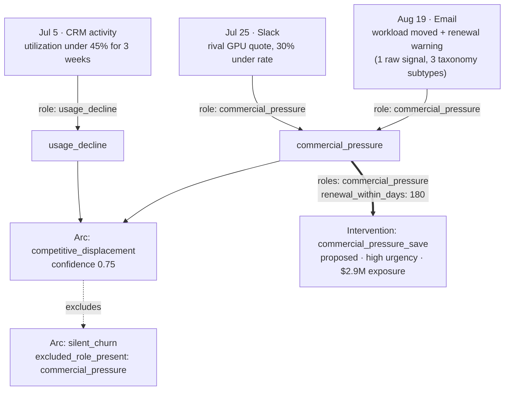
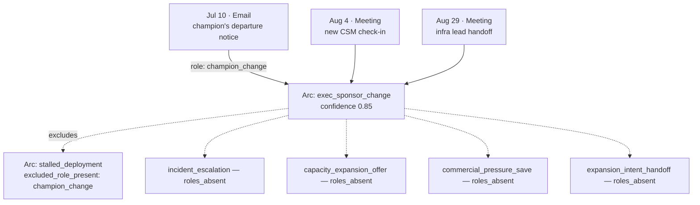

# FDE guide — provisioning and operating CustomerIntel tenants

*Written from a real, end-to-end signals-only build (Meridian Neocloud, customer_id=11, 50 accounts, 109 raw communications, real LLM classification, 2026-09) plus the gotchas that build surfaced. Every example below is real tenant data, not illustrative fiction.*

## 1. Two ways to provision a tenant

| Path | How | When |
|---|---|---|
| **Over MCP/HTTPS** — `backend/scripts/onboard_tenant.py` | A customer API key, real HTTP calls, no database access. `--customer-id N` refreshes an existing tenant instead of creating one. | Default. This is what a customer or a remote FDE does — every step is a tool call the platform audits. |
| **In-process, server-side** | SSH to the box, `docker compose exec` into `customerintelv1-app`, run a Python script that calls `create_customer()` / `generate_api_key()` / `upload_csv()` / `process_data()` / `import_communications()` directly, with `mcp_server.auth._current_api_key_var` set to the **customer's own generated key** — never the server key. | Bulk demo-tenant construction, data migrations, anything needing box access. Still genuinely user-scoped: the same per-tenant auth checks run either way, just without the HTTP hop. |

Both paths are legitimate. `onboard_tenant.py` already gets the ingest ordering right (§2); a hand-rolled server-side script has to get it right itself, and this is where every gotcha in §3 was actually found.

## 2. The standard CSV set

| File | Required? | Effect |
|---|---|---|
| `account_details.csv` | Yes | Creates/updates accounts. Required columns: `source_account_id, account_name, industry, region, arr`. **Recommended, easy to skip: `renewal_date`** — see §3.3. |
| `kpi_measurements.csv` | No | **Absent = signals-only tenant.** Its presence is the entire distinction — no separate flag. |
| `enhanced_qualitative_signals.csv` / `communications.jsonl` | No | Typed CSV rows skip LLM classification; raw communications (free text, no `signal_type`) go through it. |
| `outcomes.csv` | No | `linked_signal_id` may carry a communication ref, rewritten to the engine's own signal id at ingest. |

Ingest order (`onboard_tenant.py`'s own docstring, verified correct): **create → roster/typed CSVs → `process_data` → communications (batches ≤500) → outcomes → `process_data` → receipt.**

## 3. Signals-only customer setup

### 3.1 What makes a tenant signals-only

Nothing declarative — just omit `kpi_measurements.csv`. Every account then has `KPI HEALTH: —` in the UI, and journeys are built "from evidence alone": phases, arcs and forecasts all read `evidence_only=True` and use their evidence-equivalent thresholds instead of a health score. This is a fully supported, first-class path, not a degraded one.

### 3.2 Ingest order — the gotcha that isn't one in `onboard_tenant.py`, but will bite a custom script

`upload_csv()` only **stages** the file. `process_data()` is what actually creates real `Account` rows from it. If a custom script calls `import_communications()` before `process_data()`, every account reference resolves as `unknown` — all of it, silently, no partial success. Caught this once on a local scratch DB (`process_now=False`) before it reached a real box; worth doing the same dry run before spending real LLM calls on a bulk import.

### 3.3 The `renewal_date` gotcha

`renewal_date` is a *recommended*, not required, column — easy to leave out of a hand-built `account_details.csv`. Its absence has one specific, silent consequence: **any playbook whose trigger includes `renewal_within_days` (e.g. `commercial_pressure_save`) can never fire, tenant-wide**, and the only symptom is a `no_renewal_date` skip reason buried in that account's playbook evaluation. Building Meridian Neocloud without this column meant `commercial_pressure_save` couldn't fire on **any** of its 50 accounts until it was added back in — see the worked example in §3.5.

Format: an ISO date string in the `account_details.csv` column, or in `Account.profile_metadata['renewal_date']` / `['contract_end']` directly. It reaches the journey as an episode of `kind='renewal'`, and `days_to_renewal` is computed from **the journey's `as_of` date, not "today"** — pick a renewal date with real margin (weeks, not days) past whatever window a playbook checks, or a legitimately-future renewal can still miss the window once `as_of` catches up.

### 3.4 Forcing a rebuild after a later data change

`process_data()`'s own staleness check (`bool(accounts) and kpi_count > 0`) is structurally always-false for a signals-only tenant once its staged CSVs are consumed — it will never detect that a rebuild is needed. If you add or change account data after the initial load (e.g. backfilling `renewal_date` on an existing tenant), re-upload the CSV, call `process_data()` to merge the new `profile_metadata`, then force the rebuild directly:

```python
from journeys.wizard_a import run_wizard_a
run_wizard_a(customer_id)                        # every account
run_wizard_a(customer_id, {134, 136, 137})       # or just the accounts you touched
```

This also re-evaluates playbooks for every account touched (`evaluate_playbooks=True` by default) — expect new proposed interventions to appear as a direct result.

### 3.5 Causal graph samples

Two real accounts from Meridian Neocloud, chosen because one fires and one correctly doesn't — an FDE needs to recognize both as normal, not treat every all-skip account as a data gap.

**Vertex AI Labs (account_id=134) — a playbook fires, with a ruled-out alternative:**



Before `renewal_date` was backfilled (§3.3), the `R2 ==> IV` edge above didn't exist — the playbook evaluation read `commercial_pressure_save — no_renewal_date` instead of firing, even though the `commercial_pressure` role and its urgency floor were already satisfied.

**Granite Analytics (account_id=136) — nothing fires, correctly:**



All four `datacenter_v1` playbooks skip `roles_absent` here — not a bug, a real structural gap: this vertical's playbook catalog has no playbook keyed to a champion/sponsor-change narrative at all. The arc still classifies correctly (`exec_sponsor_change`, 85% confidence) from the same evidence; classification and playbook coverage are independent layers, and an FDE should check both before assuming a quiet account means quiet data.

### 3.6 How "why" resolves on a signals-only account

Two different mechanisms answer "why," and a signals-only tenant that hasn't reported any interventions yet only exercises one of them:

- **Episode/role matching** (arcs, "why proposed," alternative exclusions — everything in §3.5): computed fresh at read time by scanning `SIGNAL` nodes for matching roles within the journey's current scoring window. No stored graph edge is involved.
- **Edge-based evidence** (`ContextEdge`, `edge_type='LED_TO'` — the why-panel's "linked evidence" feature): only populated once `report_intervention()` actually closes an intervention into an `OUTCOME` node. A signals-only tenant with only `proposed` interventions has **zero** `ContextEdge` rows — confirmed on Vertex AI Labs directly. Don't expect to find linked-evidence edges on a freshly-provisioned tenant; they show up after the first real outcome is logged.

## 4. Verifying a tenant after provisioning

Don't trust the import tool's own self-reported counts alone — query the tables directly:

```python
Account.query.filter_by(customer_id=cid).count()                                    # expect your account count
ContextNode.query.filter_by(customer_id=cid, node_type='SIGNAL').count()            # expect > 0 per account, none at 0
JourneyData.query.filter_by(customer_id=cid).count()                                 # expect exactly one per account
```

On a tenant provisioned before the fix in §5, the SIGNAL node total can run well ahead of the ingest tool's own `nodes_written` — that gap is the tell.

## 5. Known gotcha: bulk imports could double every SIGNAL node (fixed 2026-09-13)

`signal_engine/pipeline.py`'s `process_pending()` locked its whole fetched batch with `SELECT ... FOR UPDATE SKIP LOCKED` but committed once per signal inside the loop — Postgres releases the *entire* batch's lock at the first commit, so the always-on background worker (`SIGNAL_WORKER`, on by default) could grab and re-materialize the rest of the same batch mid-import. Invisible on a trickle of single-item ingests; on a 109-communication bulk import it doubled 89% of the tenant's SIGNAL nodes. Fixed in `fix/signal-drain-race` (merged to `main` 2026-09-13) by claiming the whole batch with a sentinel and committing that immediately, before any per-signal work.

If you're auditing a tenant provisioned **before** that fix, check for it and repair in place rather than re-provisioning:

```bash
python scripts/repair_duplicate_evidence.py --dry-run     # tenant-wide; no --customer-id filter exists yet
```

Read its output before running for real — it has no per-tenant scoping, so a dry run can surface duplicates on tenants you weren't asking about. Re-point/delete only what you mean to touch.

---
Related: `docs/design/journey-canvas.md` (the UI this data feeds), `docs/design/showcase/README.md` (two smaller showcase tenants, one signals-only), `docs/design/backlog-provisions.md` P1 (the original signals-only-tier proposal), `backend/scripts/onboard_tenant.py` (the script itself).
